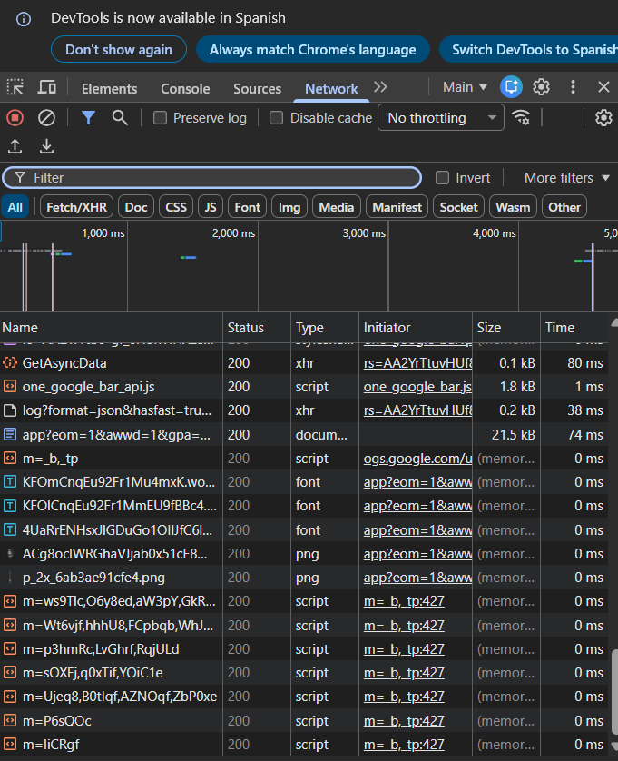

# Reporte de Auditoría Web

## 1. Rendimiento y Red (Network)
Tras analizar la carga de recursos, se adjuntan los tiempos de carga y el estado de las peticiones HTTP (códigos 200, 4xx, 5xx).

## 2. Errores de Ejecución (Console)
Se han detectado errores de JavaScript en la consola que están bloqueando la correcta ejecución en el cliente:
